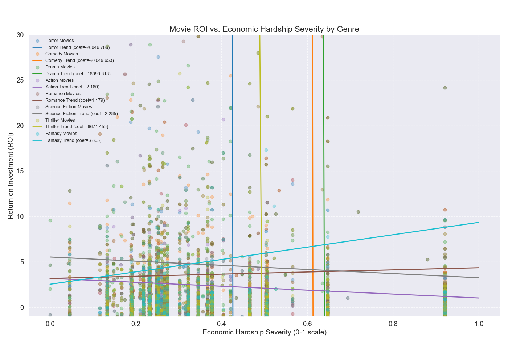
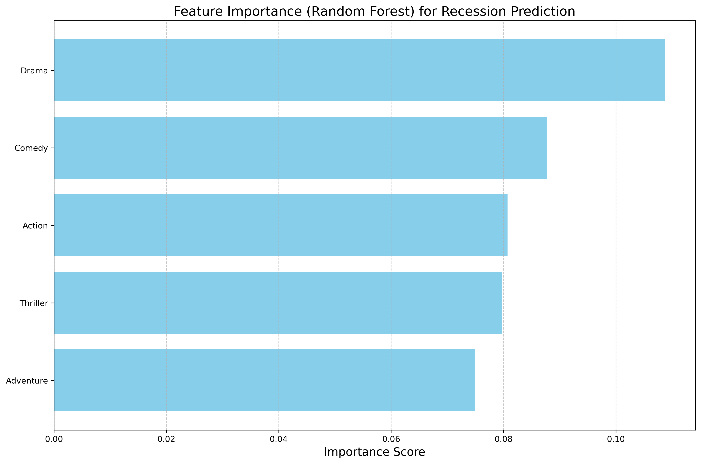

# CS506-Project 

## Project 

### Project Description
Our project investigates the relationship between economic conditions and movie performance, with a specific focus on horror films. We aim to test the hypothesis that during economic downturns, horror movies not only increase in production but also outperform other genres in terms of return on investment (ROI).

### Goals
1. Analyze the correlation between economic indicators (S&P 500, recession periods) and horror movie performance metrics (box office revenue, ROI)
2. Compare horror movie performance against other genres during economic downturns
3. Identify patterns in horror movie production volume during different economic cycles

### Getting Started

```bash
git clone https://github.com/yourusername/CS506-Project.git
pip install -r requirements.txt
python all.py
```

### Data Collection
We will use a dataset that has box office information from each movie and within the dataset it will also contain information such as movie name, genre, and release date information. We will use a dataset from Kaggle for this information regarding movies: https://www.kaggle.com/datasets/karthiknamboori1/movie-datasets. We will also need information about the S&P 500 for this project. We can download a dataset from https://www.nasdaq.com/market-activity/index/spx/historical that contains this data.

## Midterm Report Video

https://www.youtube.com/watch?v=hgbGlpkEcKk

## Description of data processing done so far

We created seperate .csv files that just have horror movies from our first movie dataset .csv file. We have also created .csv files that contain a movie's budget and revenue adjusted for inflation. 

## Linear Regression Model

We perfomed linear regression to examine the relationship between economic conditions and movie performance across different genres.

1. **Data Processing**: We preprocess movie data to calculate ROI (Return on Investment), while economic data is transformed into a recession severity score based on S&P 500 yearly returns and volatility.

2. **Economic Hardship Metric**: We create a normalized recession severity score (0-1 scale) where higher values indicate worse economic conditions, derived from negative yearly returns and market volatility.

3. **Genre Comparison**: We analyze multiple genres (Horror, Comedy, Drama, Action, Romance, Science-Fiction, Thriller, Fantasy) to compare their performance during different economic conditions.

4. **Regression Analysis**: For each genre, we perform linear regression between economic hardship severity and movie ROI, calculating correlation coefficients and regression slopes to quantify the relationship.

5. **Visualization**: We generate scatter plots with regression lines for each genre, allowing visual comparison of how different genres respond to economic downturns.

### Scatter Plot with Regression Line for Horror Movies



### Data Contextualization  

The table below answers a key baseline question raised in the mid-term feedback: **are certain genres genuinely more common in economic downturns, or are they simply the most-produced genres overall?**

| Genre | Overall&nbsp;Share&nbsp;(%) | Hardship&nbsp;Share&nbsp;(%) |
|---|---|---|
| Drama | 25.5 | 23.1 |
| Comedy | 18.9 | 20.5 |
| Thriller | 14.6 | 15.4 |
| Action | 14.0 | 10.3 |
| Romance | 10.0 | 15.4 |
| Science Fiction | 6.5 | 2.6 |
| Horror | 5.7 | 7.7 |
| Fantasy | 4.8 | 5.1 |

**How to read the columns**

* **Overall Share (%)** – the genre’s share of **all** theatrical releases in our dataset (1915-2022).  
* **Hardship Share (%)** – the same genre’s share counted **only during high-hardship months**  
  (months where our S&P-500 hardship score > 0.5).

Because each column sums to 100 %, we can compare the two percentages directly to see which genres expand or contract when the economy sags.

**Key take-aways**

* **Romance** jumps from **10 % → 15 %** of releases – the largest relative increase (+5.4 pts). Studios appear to green-light more romance titles during recessions.  
* **Comedy** and **Horror** both inch upward, suggesting audiences (and distributors) favour escapism or catharsis in tough times.  
* **Action** and **Science Fiction** shrink the most, consistent with their higher production budgets and greater financial risk.  
* **Drama** remains the single biggest slice overall, but its share actually falls slightly in hardship months, showing that its apparent “spike” in raw counts is just a reflection of being the dominant genre year-round.

This baseline check confirms that genre shifts we observe in recession visualizations are **real proportional changes**, not just artifacts of Drama’s normal ubiquity.

### Regression Results Table

Our linear regression analysis comparing economic hardship severity with movie ROI across genres yielded the following results:

| Genre           | Sample Size  | Correlation     | Coefficient     | Intercept      |
|----------------|--------------|----------------|----------------|----------------|
| Horror          | 360          | -0.069          | -26046.786      | 11110.064      |
| Comedy          | 1185         | -0.020          | -27049.653      | 16591.332      |
| Drama           | 1550         | -0.015          | -18093.318      | 11575.840      |
| Action          | 949          | -0.039          | -2.160          | 3.175          |
| Romance         | 613          | 0.022           | 1.179           | 3.166          |
| Science-Fiction | 442          | -0.011          | -2.285          | 5.527          |
| Thriller        | 966          | -0.037          | -6671.453       | 3294.238       |
| Fantasy         | 343          | 0.031           | 6.805           | 2.530          |

These results show the correlation coefficients, regression coefficients, and intercepts for each genre, providing quantitative measures of how movie ROI relates to economic conditions across different types of films.

### Movie Production During Economic Downturns

Our analysis of movie releases during high recession periods (economic hardship severity > 0.5) revealed the following distribution by genre:

```
Drama: 321 movies
Comedy: 253 movies
Thriller: 184 movies
Action: 176 movies
Romance: 151 movies
Adventure: 128 movies
Crime: 110 movies
Family: 82 movies
Science-Fiction: 75 movies
Fantasy: 54 movies
Mystery: 49 movies
Horror: 48 movies
Animation: 41 movies
War: 27 movies
Music: 22 movies
History: 21 movies
Documentary: 12 movies
Foreign: 8 movies
Western: 7 movies
```

## KNN Model

We also used a KNN model to see if there was a relationship between S&P 500 close prices and the return on investment (ROI) of movies based on genre. After running a KNN model with these two different variables we found the following information:

```
R-squared Horror: 0.759705151925964
R-squared Fantasy: 0.9825107332839583
R-squared Science-Fiction: 0.983449523590625
R-squared Action: 0.9727091902434848
R-squared Adventure: 0.9871167995233564
R-squared Family: 0.971742928596874
R-squared Thriller: 0.929324090010516
R-squared Comedy: 0.9365027951550314
R-squared Crime: 0.9823181695215141
R-squared Drama: 0.8750054404047017
R-squared Science-Fiction: 0.983449523590625
R-squared Mystery: 0.9757709184000535
R-squared War: 0.9847504770460153
R-squared History: 0.98584741707319
R-squared Documentary: 0.12299558668450161
R-squared Animation: 0.9512137600390157
```

Our R-squared values are high for almost every genre which shows that our KNN model fits pretty well between a movie's return on investment and the S&P 500 prices. The best fitting genre was adventure movies and the worst fitting genre was documentary movies.

## Random Forest Model

We also used a random forest model to try to predict if there is a recession based on features of a movie, and we graphed the feature importance of the model: 



Using the features we found, the model was able to predict if there was a recession with an accuracy of 73% which is pretty good. 

```bash
Model Accuracy: 0.73

Classification Report:
              precision    recall  f1-score   support

       False       0.78      0.88      0.82        16
        True       0.50      0.33      0.40         6

    accuracy                           0.73        22
   macro avg       0.64      0.60      0.61        22
weighted avg       0.70      0.73      0.71        22
```

Genre Importance for recession prediction (a more complete version of the graph above):

```
Genre Importance for Recession Prediction:
              Genre  Importance
4             Drama    0.108687
2            Comedy    0.087686
0            Action    0.080717
9          Thriller    0.079734
1         Adventure    0.074930
8   Science-Fiction    0.069351
7           Romance    0.068236
6            Horror    0.062037
10            movie    0.055207
5           Fantasy    0.038078
3       Documentary    0.025025
```

### Conclusion from Random Forest Model

Drama (Highest Importance - 0.109): Drama films show the strongest correlation with recession periods. This suggests that during economic downturns, there may be an increase in drama production or that the pattern of drama releases serves as a reliable indicator of economic conditions. People may be drawn to more serious, reflective content during challenging economic times.

Horror films rank relatively low in importance (0.062), falling below genres like Science-Fiction and Romance. This lower ranking is particularly significant given our initial hypothesis about horror films:
- The model suggests that horror movie production patterns are not strongly correlated with recession periods
- This contradicts the common assumption that horror films perform better during economic downturns
- The data indicates that horror may not be a "recession-proof" genre as sometimes claimed
- When there is a recession, the production patterns of horror films don't show distinctive changes that would make them reliable predictors of economic conditions

## Preliminary Results

These findings from our linear regression model indicate patterns in movie production trends during economic downturns and suggest that certain genres are more resilient to economic hardship than others. Something we noticed that is related to our inital hypothesis was that horror movies are not commonly made during economic downturns. This information leads us to think that there is a pattern or corellation between movie production and the S&P 500, but our initial hypothesis of focusing on horror movies might be incorrect. We will use this information to inspect our data more closely and look at other genres to see if there is more of a correlation with the S&P 500 compared to horror movies.

From our inital KNN model we found that are R-squared values are relatively high which could suggest we have found a correlation between a movie's return on investment and the close prices of the S&P 500. Of the popular genres we tested in our KNN model we found that horror movies seem to have the lowest correlation which further suggests that our inital hypothesis might be incorrect. 

These two models have starting to give us a clear pattern of our data which will allow us to investigate our data further and reach our final conclusions. 

## Final Results

After analyzing our data using linear regression, K-Nearest Neighbors (KNN), and a random forest classifier, we found that the relationship between economic conditions and movie performance is not as straightforward as we thought. From our results we discovered that horror movies do not outperform other genres during economic downturrns.
